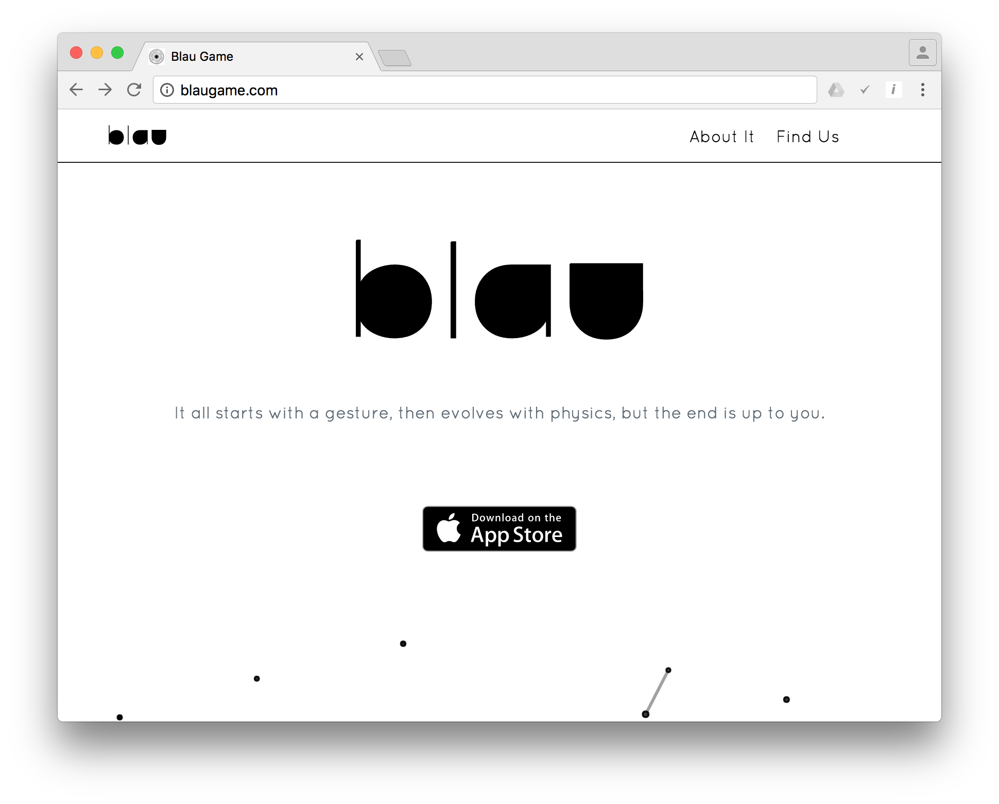

<p align="center">
  <a href="www.blaugame.com">
    
  </a>
</p>

<p align="center">
  Blau Game official website.
</p>

<p align="center">

  <a href="https://codeship.com/projects/7a6a8ec0-77bb-0134-da23-5251019101b9/status?branch=dev"></a>

  <a href="https://travis-ci.org/xablauger-studios/blau-site"></a>

  <a href="https://codeclimate.com/github/mabrasil/flat-palettes"></a>

  <a href="https://david-dm.org/xablauger-studios/blau-site" title="Dependency status"></a>

  <a href="https://david-dm.org/xablauger-studios/blau-site#info=devDependencies" title="devDependency status"></a>

</p>

## Table of Contents

- [The Game](#the-game)
- [Usage](#usage)
- [Contributing](#contributing)
- [License](#license)
- [Credits](#credits)

## The Game

<p align="center">
  <a href="https://itunes.apple.com/br/app/blau/id1150066458">
    
  </a>
</p>

**blau** is game where your goal is the simplest possible one: get to the end 
of each level. How? By guiding blau - actually, an abstract black circle - 
through many simple - yet elegant - puzzles, avoiding physics-based traps and collecting shapes; to every level, there are many solutions, which go from beautifully simple to deep and complex ones - **it all starts with a gesture, 
then evolves with physics, but the end is up to you**.

[Watch now the official game teaser!](https://www.youtube.com/watch?v=kNVg4-tiJzA)

<p align="center">
  <a href="https://itunes.apple.com/br/app/blau/id1150066458">
    
  </a>
</p>

## Usage

### Getting Started

Make sure you have the main dependencies:

- [Git](http://git-scm.com/downloads)
- [NodeJS](http://nodejs.org/)

Clone this repository:

```sh
$ git clone https://github.com/xablauger-studios/blau-site.git
```

Install all dependencies:

```sh
$ cd blau-site
$ npm install
```

### Structure

If everything from the [Getting Started](#getting-started) section goes well, you should have this:

```
|-- docs/
|-- src/
|   |-- images/
|   |-- scripts/
|   |-- styles/
|   |-- templates/
|   |-- vendor/
|   |-- videos/
|   |-- config.json
|   |-- manifest.json
|-- tasks/
|   |-- deploy/
|       |-- gh-pages.js
|   |-- templates/
|       |-- compiler.js
|-- .babelrc
|-- .bowerrc
|-- .editorconfig
|-- .eslint
|-- .gitignore
|-- .styluslintrc
|-- .travis.yml
|-- bower.json
|-- package.json
|-- [...]
```

### Customization

For most of the updates/changes in our page, just go to the 
[`config.json`](/src/config.json) file and change the value of variables.

#### Basic Information About The Game

Here goes the app basic data - which is used, for example, to feed the page
metadata.

```json
"about":{
  "title":"Blau Game",
  "description":"It all starts with a gesture, then evolves with physics, but the end is up to you.",
  "author":"Xablauger Software",
  "canonical":"https://blaugame.com",
  "image":"",
  "appleItunesAppID":"1150066458",
  "mobile":{
    "themeColor":"#ffffff"
  },
  "googleAnalytics":{
    "ID":"UA-58120604-9"
  },
  "socialNetworks":[
    {
      "name":"Facebook",
      "ID":"blaugame"
    },
    {
      "name":"Twitter",
      "ID":"blaugame"
    },
    {
      "name":"Instagram",
      "ID":"blaugame"
    },
    {
      "name":"YouTube",
      "ID":"UCT5wWP3UeA7og9CVVz2USgA"
    }
  ]
}
```

#### Players Testimonials

Here goes all the opinions about the game which come from specialist sites/
other players.

```json
{
  "name":"testimonials",
  "shortLabel":"What others say It is",
  "longLabel":"what do other people say blau is?",
  "teamTestimonials":[
    {
      "author":{
        "name":"Matheus Martins",
        "role":"Lead Game Programmer",
        "company":"Blau Game"
      },
      "opinion":"The best game I've ever palyed.",
      "link":"https://blaugame.com"
    }
  ],
  "playersTestimonials":[
    {
      "author":{
        "name":"Press Coordination Office",
        "role":"",
        "company":"IFCE"
      },
      "opinion":"[...]It's a super exciting game[...]",
      "link":"https://www.facebook.com/ifce.campusfortaleza/photos/pb.696732933672509.-2207520000.1476304727./1366599953352467/?type=3&theater"
    }
  ]
}
```

### Workflow

All the tasks needed for development automation are defined in the
[`package.json`](package.json) *scripts* property and can be run via:

`npm run <command>`

Here is a summary of the main commands:

- `build:templates`: **compile** `.pug` files and **validate** the output.
- `build:scripts`: **lint**, **minify** and **concatenate** `.js` files.
- `build:styles`: **lint** and **compile** `.styl` files.
- `build:vendor`: **copy** `src/vendor` to `dist/vendor`.
- `build:images`: **optimize** raster and vector images.
- `build:videos`: **copy** `src/videos` to `dist/videos`.
- `build`: **run** all `build:` tasks.
- `watch`: **watch** `src/**/*` and **run** the corresponding `build:` tasks while serves the result.
- `test:complexity`: **test** against static analysis complexity test.
- `test:perf`: **test** against web performance best practices.
- `test:regression`: **test** resulted CSS for unexpected visual problems.
- `test:npm`: **test** if project *npm dependencies* are up to date.
- `deploy`: **deploy** current `dist` to *GitHub Pages*.

## Contributing

Contributions are very welcome! If you'd like to contribute, 
[these guidelines](.github/contributing.md) may help you.

## License

- [Blau Game Official Site](https://github.com/xalbauger-studios/blau-site) 
source code is licensed under the [MIT License]().

- Other stuff related to *Blau Game* itself - e.g. logo and visual identity - 
which are available in this repo are licensed under the [Creative Commons  Attribution-NonCommercial-NoDerivatives 4.0 International](http://creativecommons.org/licenses/by-nc-nd/4.0/) License.

- The *Download on the App Store* badge has *All Rights Reserved to Apple Inc*.

**All contributions are assumed to be also licensed under the same.**

## Credits

- Some of the base stylization scripts and styles themselves were originally
written by the [milligram](https://milligram.github.io/) team. The original 
repo can be found [here](https://github.com/milligram/milligram.github.io/). Copyright © 2016 [CJ Patoilo](https://github.com/cjpatoilo).
